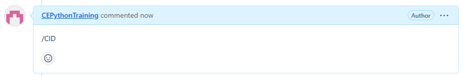

GitHub Action Documentation
###########################

This document provides an overview of the GitHub Action used in the `Issue Action` project.

Overview
********

The GitHub Action in this project is designed to automate the creation of branches based on issue comments or assignments, and to close issues when pull requests are merged.

Configuration
*************

The action reads configuration values from a YAML file located at `.github/issue-config.yml`. The configuration file includes the following keys:

- `autoCloseIssue`: A boolean value indicating whether issues should be automatically closed when pull requests are merged.
- `defaultBranch`: The default branch to use for creating new branches.
- `gitSafeReplacementChar`: A character to replace spaces in branch names.

Example configuration file:

.. code-block:: yaml

    autoCloseIssue: true
    defaultBranch: development
    gitSafeReplacementChar: _

Workflow
********

The workflow is defined in a YAML file located at `.github/workflows/issue-control.yml`. It includes the following jobs:

1. **create-branch**: This job is triggered by issue comments or assignments
============================================================================

Option 1. Create branch by adding "/CID" as a comment in the issue

Option 2. Assign a user to the issue

This job performs the following steps:

- This will create a branch starting with "issue-<issue ID><Title of the issue>" in the branch name.
- There will also be a comment added to the issue with the branch name as a link.

2. **close-issue**: This job is triggered when a pull request is merged and performs the following steps:
=========================================================================================================
    | This step will close the issue that is associated with the pull request.
    | This is based on the branch name that starts with the issue ID.
